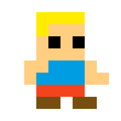
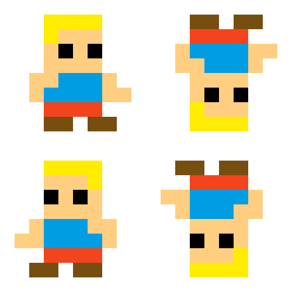

# Sprite flip

En molts videojocs 2D és bastant comú invertir horitzontal i verticalment un sprite per tal d'obtenir les diferents orientacions d'un personatge.

Per exemple, a partir d'aquest sprite:

Podem obtenir els seus "flips" horitzontals i verticals:

## Input

En primer lloc el nombre de línies de l'sprite.
A continuació ve l'sprite ASCII-ART.

## Output

S'imprimirà l'*spritesheet* amb l'spirte ORIGINAL, junt amb les inversions HORITZONTAL, VERTICAL i HORITZONTAL/VERTICAL (separades per línies en blanc).
