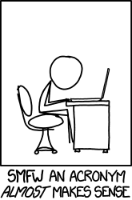

# Acrònims

En el món de la informàtica els acrònims són molt comuns: [https://en.wikipedia.org/wiki/List_of_computing_and_IT_abbreviations](https://en.wikipedia.org/wiki/List_of_computing_and_IT_abbreviations)

Transforma una frase en el seu acrònim.



## Input

Una frase en una línia.

## Output

L'acrònim de la frase

## Tests

### Test
```input
Hello world!
```
```output
HW
```

### Test
```input
is this the real life
```
```output
ITTRL
```

### Test
```input
what the font
```
```output
WTF
```

### Test
```input
Read the fucking manual
```
```output
RTFM
```

### Test
```input
a
```
```output
A
```

### Test
```input
GNU's not Unix
```
```output
GNU
```

### Test
```input
PHP Hypertext Preprocessor
```
```output
PHP
```

### Test
```input
What you see is what you get
```
```output
WYSIWYG
```

### Test private
```input
hola Mon
```
```output
HM
```
