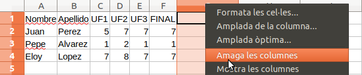

# Amaga les columnes

Els programes de Full de Càlcul solen tenir la funció d'amagar columnes.

Tractem d'implementar aquesta funcionalitat...

## Input

L'entrada consta en primer lloc d'un Full de càlcul:

- Els dos primers números  i  indiquen la quantitat de files i columnes

- A continuació ve la taula amb les dades (Les files separades per un salt de línia i les columnes separades per espai en blanc)

En segon lloc venen les columnes que cal ocultar:

- S'inidica el número  de columnes que s'han d'ocultar

- Després venen els índexs d'aquestes columnes (començant per 1)

## Output

S'imprimirà la taula, sense mostrar les columnes indicades.
Tots els camps de la taula han d'ocupar **10 espais i aliniats a l'esquerra**
