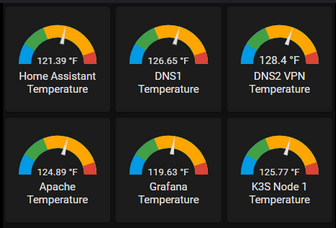

Dada una serie de temperaturas registradas en un día, realiza un análisis estadístico que incluya:

    La cantidad de mediciones
    La suma de todas las temperaturas
    La temperatura media
    La temperatura más alta
    La temperatura más baja
    El porcentaje de mediciones por debajo de la media
    El porcentaje de mediciones por encima de la media
    Si alguna medición coincide exactamente con la media

## Input

* Un número entero que indica la cantidad de mediciones.
* Una secuencia de números decimales representando las temperaturas registradas.

## Output

Cantidad de mediciones: `entero`  
Suma total: `decimal`  
Temperatura media: `decimal`  
Temperatura máxima: `decimal`  
Temperatura mínima: `decimal`  
Porcentaje por debajo de la media: `decimal + %`  
Porcentaje por encima de la media: `decimal + %`  
Existe una temperatura igual a la media: `true | false`