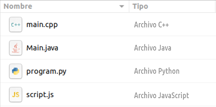

# Arxius de codi font



Cada llenguatge de programació té les seves pròpies extensions per als arxius de codi font.

Els de Java són `.java`, els JavaScript són `.js`, en Python és `py`, en C++ és `.cpp` ...

Donada una llista d'arxius amb el nom i tipus, imprimeix la llista en l'ordre invers, i les columnes intercanviades (primer tipus i després nom).

## Input

L'entrada consta de **quatre** línies.

A cada línia hi ha:
 * una paraula que es el `nom` de l'arxiu (amb l'extensió inclosa)
 * y la resta de la línia és el `tipus` d'arxiu.

## Output

S'imprimirà cada arxiu en una línia, primer el `tipus` i després el `nom`.

## Tests

### Test
```input
main.cpp Archivo C++
Main.java Archivo Java
program.py Archivo Python
script.js Archivo JavaScript
```
```output
Archivo JavaScript script.js 
Archivo Python program.py 
Archivo Java Main.java 
Archivo C++ main.cpp 
```

### Test
```input
index.php Archivo PHP
sample.cs Archivo C#
app.swift Archivo Swift
MainActivity.kt Archivo Kotlin
```
```output
Archivo Kotlin MainActivity.kt
Archivo Swift app.swift
Archivo C# sample.cs
Archivo PHP index.php
```

### Test
```input
index.ts Archivo TypeScript
out.asm Archivo assembler
query.sql Archivo Structured Query Language
main.rs Archivo Rust
```
```output
Archivo Rust main.rs
Archivo Structured Query Language query.sql
Archivo assembler out.asm
Archivo TypeScript index.ts
```
