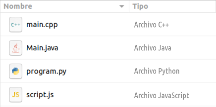

# Arxius de codi font

Cada llenguatge de programació té les seves pròpies extensions per als arxius de codi font.

Els de Java són `.java`, els JavaScript són `.js`, en Python és `py`, en C++ és `.cpp` ...

Donada una llista d'arxius amb el nom i tipus, imprimeix la llista en l'ordre invers, i les columnes intercanviades (primer tipus i després nom).

## Input

L'entrada consta de **quatre** línies.

En cada línia hi ha una paraula que es el  de l'arxiu (amb l'extensió inclosa), y la resta de la línia és el  d'arxiu.

## Output

S'imprimirà cada arxiu en una línia, primer el  i després el
