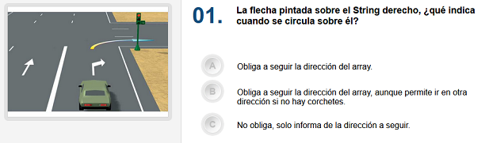

# Auto-test



En el examen del carnet de conducir hay 30 preguntas, con tres posibles respuestas (a, b, c). Se aprueba si se fallan como máximo 3 respuestas.

Deseamos hacer una programa para auto-corregir un test de examen. Por el momento nos centrarmos solo en las respuestas, y no en las preguntas.

El usuario introducirá las respuestas a cada pregunta, y al finalizar se le mostrará el resultado, indicándole las respuestas correctas a las preguntas que haya fallado.

Las respuestas correctas a las preguntas del test son estas:

```text
"a", "b", "a", "c", "a", "b", "b", "c", "b", "c", "a", "c", "b", "a", "a", "a", "c", "c", "b", "a", "c", "b", "c", "c", "a", "a", "c", "a", "a", "c"
```

## Input

La entrada consiste en las respuestas del usuario: 30 letras (`a`, `b`, `c`) separadas por espacios

## Output

- En la primera línea se imprimirá `TEST SUPENDIDO` o `TEST APROBADO`

- En la segunda línea se imprimirá `X fallos`

- En la tercera línea se imprimirán los números de pregunta separados por espacios en blanco. Si el número de pregunta solo ocupa un dígito, se precederá con un espacio.

- En la cuarta línia se imprimirán las respuestas dadas por el usuario. Cada respuesta irá precedida y sucedida por un espacio en blanco.

- En la quinta línia se alinearán las respuestas correctas a aquellas preguntas que se hayan fallado.
