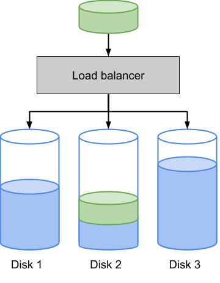

# Balanceig de càrrega

El balanceig de càrrega consisteix en la distribució de la feina a realitzar entre diferents recursos com ordinadors, clústers, línies de xarxa, unitats centrals de processament o dispositius de disc.

En aquest problema tractarem el balanceig de càrrega de dispositius de disc en funció de l'espai disponible.

Quan s'ha d'emmagatzemar un bloc de dades, el balancejador de càrrega escull el disc amb més espai disponible per a emmagaztemar-les:



## Input

En primer lloc trobem el nombre de discs .

A continuació ve l'espai ocupat a cada disc.

Seguidament ve un seqüència amb els tamanys dels blocs de dades que s'han d'emmagatzemar. La seqüència finalitza amb un `0`.

## Output

S'imprimirà l'espai ocupat en cada disc un cop s'han emmagatzemat tots els blocs.

## Tests

### Test
```input
2
0 0
2 3 6 1 5 2   0
```
```output
10 9
```

### Test
```input
2
0 0
2 3 6 1 5 2   0
```
```output
10 9
```

### Test
```input
3
1 4 5
1 2 3 4 5  0
```
```output
7 8 10
```

### Test
```input
5
3 0 1 6 10
10  4  1  5  3  1  2  4  8  9     0
```
```output
17 10 12 18 10
```

### Test
```input
6
10 0 10 10 30 40
16  54  40  36  16  57  20  52  36  29  24  26  16  20  35     0
```
```output
90 92 99 117 87 92
```

### Test private
```input
8
100 0 110 70 20 35 45 90
38  65  16  88  20  49  94  81  32  56  13  47  32  52  86  81  75  58  71  59  24  31  88  75  90  13  76  42  97  103  93  87  47  102  35  11  107  55  17  16  105  10  18  94  73  96  67  17  47  102     0
```
```output
407 423 425 435 411 485 420 415
```
