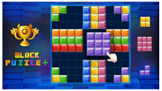
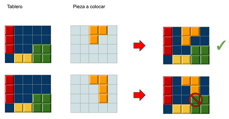

# Block Puzzle

En el juego Block Puzzle, el jugador va colocando unas piezas en el tablero completando filas o columnas. Las piezas no se pueden superponer.

Dado un tablero con las fichas que ya estaban colocadas, y otro tablero con la ficha que desea colocar el jugador, indica si la ficha se puede colocar en esa posición.

## Input

Los dos primeros números  y  indican el alto y ancho del tablero.

A continuación vienen las x casillas del tablero (`1` significa que la casilla está ocupada y `0` que está libre).

A continación viene otro tablero de x casillas, con la ficha que trata de poner el juagdor (`1` indica las casillas que ocupa la ficha).

## Output

Se imprimirá `true` si la ficha se puede colocar en esa posición, y `false` en caso contrario
