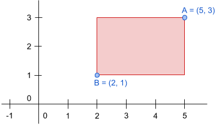

# Perímetre d'un rectangle

El perímetre d'un rectangle és la suma de la longitud de tots els seus costats.

Un rectangle es pot definir proporcionant les coordenades del seu cantó superior dret, i les del seu cantó inferior esquerra:



## Input

La entrada consta de **dues** coordenades, primer el cantó superior dret i segon el cantó inferior esquerra.

Per a cada coordenada el primer nombre  es la posició en l'eix horitzontal, y el segon nombre  és la posició en l'eix vertical.

## Output

Un nombre enter indicant el perímetre del rectangle

## Tests

### Test
```input
3 2
0 0
```
```output
10
```

### Test
```input
3 2
0 0
```
```output
10
```

### Test
```input
1 1
1 1
```
```output
0
```

### Test
```input
2 2
1 1
```
```output
4
```

### Test
```input
1 1
-1 -1
```
```output
8
```

### Test
```input
4 7
-2 -5
```
```output
36
```

### Test
```input
7 6
2 4
```
```output
14
```

### Test
```input
3 10
1 8
```
```output
8
```
