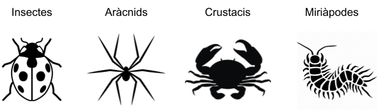

# Artròpodes

En la classe de Naturals estan estudiant els artròpodes. Són animals invertebrats dotats d'un esquelet extern i apèndixs articulats. Es divideixen en insectes, aràcnids, crustacis i miriàpodes. El nombre de potes en aquests animals és molt variable:

- Els insectes tenen 6 potes

- Els aràcnids tenen 8 potes

- Els crustacis tenen 10 potes

- Els miriàpodes tenen 2 o 4 potes per cada segment del seu cos

Un dia la professora va demanar als alumnes que portessin artròpodes a classe i els va posar un problema de matemàtiques: calcular el nombre de pates de tots els animals que havien portat.

## Input

El primer nombre  indica el nombre d'insectes.

El segon nombre  indica el nombre d'aràcnids.

El tercer nombre  indica el nombre de crustacis.

El quart nombre  indica el nombre de miriàpodes de 2 potes i el cinquè el nombre  el nombre de segments que tenen.

El sisè nombre  indica el nombre de miriàpodes de 4 potes i el setè nombre  el nombre de segments que tenen.

## Output

Un nombre indicant la quantitat total de potes.
