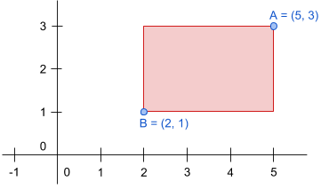

# Emmarcant les fotos

En Joan té un munt de fotos per a emmarcar, i vol comprar els marcs.

Els marcs han de ser suficientment grans com per a que càpiga la foto i a més a més ha de tenir la mateixa proporció per a que quede bé.

La definició del rectangle d'una foto i d'un marc es pot fer amb les coordenades dels seus punts superior-dreta i inferior-esquerra:



## Input

La entrada consta de la definició del rectangle de la **foto** i del rectangle del **marc**.

Per a cada rectangle s'indiquen les coordenades (x, y) dels seus cantons superior-dreta i inferior-esquerra.

## Output

S'imprimirà `true` si el marc és adequat per a la foto, i `false` si no ho és.

## Tests

### Test
```input
1 1  0 0
1 1  0 0 
```
```output
true
```
```explanation

```

### Test
```input
1 1 0 0
1 1 0 0
```
```output
true
```

### Test
```input
1 1 0 0
2 2 0 0
```
```output
true
```

### Test
```input
1 1 0 0
3 2 0 0
```
```output
false
```

### Test
```input
1 2  0 0
4 2  2 1
```
```output
true
```

### Test
```input
1 1  -1 0
4 3  3 1
```
```output
true
```

### Test
```input
1 2  -1 0
4 2  3 1
```
```output
false
```

### Test
```input
4 -2  -1 1
3 2  1 1
```
```output
false
```

### Test
```input
4 3  0 1
8 6  0 1
```
```output
false
```
