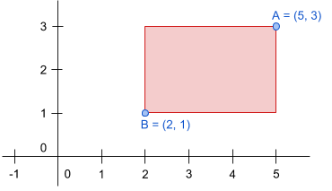

# Emmarcant les fotos

En Joan té un munt de fotos per a emmarcar, i vol comprar els marcs.

Els marcs han de ser suficientment grans com per a que hi càpiga la foto i a més a més ha de tenir la mateixa proporció per a que quedi bé.

La definició del rectangle d'una foto i d'un marc es pot fer amb les coordenades dels seus punts superior-dreta i inferior-esquerra:

## Input

La entrada consta de la definició del rectangle de la **foto** i del rectangle del **marc**.

Per a cada rectangle s'indiquen les coordenades (x, y) dels seus cantons superior-dreta i inferior-esquerra.

## Output

S'imprimirà "true" si el marc és adequat per a la foto, i "false" si no ho és.
