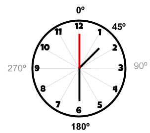
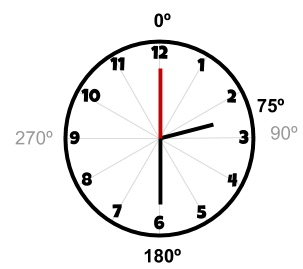
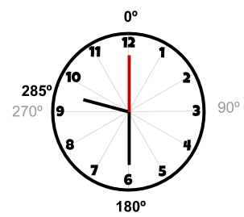
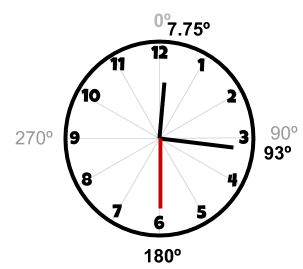

# Rellotge de manilles

En un rellotge les manilles avancen una mica a cada segon. La manilla dels segons és la que avança més ràpid (6 graus cada segon). La manilla dels minuts és una mica més lenta (6 graus cada minut). I la manilla de les hores és la que avança més lentament (30 graus cada hora).

Però totes tres manilles avancen sempre a cada segon. Així, per exemple si és la 1:30:00, la manilla de les hores estarà a 45º, la dels minuts a 180º i la dels segons a 360º:



## Input

La entrada consisteix en una hora en format HH:MM:SS

## Output

S'imprimiran els graus de cada manilla (HH,MM,SS) que corresponen a l'hora, cadascuna en una línia.

## Tests

### Test
```input
0 0 0
```
```output
0.0
0.0
0.0
```
```explanation
La manilla de les hores està a 75º
La manilla dels minuts està a 180º
La manilla dels segons està a 0º


```

### Test
```input
2 30 0
```
```output
75.0
180.0
0.0
```
```explanation

```

### Test
```input
9 30 0
```
```output
285.0
180.0
0.0
```
```explanation

```

### Test
```input
0 15 30
```
```output
7.75
93.0
180.0
```

### Test
```input
11 59 59
```
```output
359.99167
359.9
354.0
```

### Test
```input
7 43 23
```
```output
231.69167
260.3
138.0
```

### Test private
```input
6 30 30
```
```output
195.25
183.0
180.0
```
