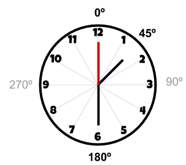

# Rellotge de manilles

En un rellotge les manilles avancen una mica a cada segon. La manilla dels segons és la que avança més ràpid (6 graus cada segon). La manilla dels minuts és una mica més lenta (6 graus cada minut). I la manilla de les hores és la que avança més lentament (30 graus cada hora).

Però totes tres manilles avancen sempre a cada segon. Així, per exemple si és la 1:30:00, la manilla de les hores estarà a 45º, la dels minuts a 180º i la dels segons a 360º:

## Input

La entrada consisteix en una hora en format HH:MM:SS

## Output

S'imprimiran els graus de cada manilla (HH,MM,SS) que corresponen a l'hora, cadascuna en una línia.
