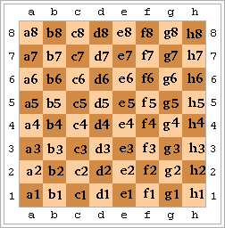

# Notació algebraica als escacs

Les caselles del tauler d'escacs es poden identificar per la seva fila i columna.

Hi han diverses notacions per a identificar la fila i columna d'una casella.

La més senzilla és la númèrica, on s'identifica cada fila i columna pel seu número d'ordre.

Una altra notació és l'algebraica, on la fila d'identifica pel seu número i la columna per les lletres minúscules a, b, c, d, e, f, g, h.



## Input

La entrada consisteix en dos nombres  i  corresponents a la fila i columna d'una casella.

## Output

S'imprimirà la posició de la casella en notació algebraica.

## Tests

### Test
```input
1 1
```
```output
a1
```

### Test
```input
2 3
```
```output
b3
```

### Test
```input
3 1
```
```output
c1
```

### Test
```input
4 8
```
```output
d8
```

### Test
```input
5 7
```
```output
e7
```

### Test
```input
6 6
```
```output
f6
```

### Test
```input
7 8
```
```output
g8
```

### Test
```input
8 1
```
```output
h1
```

### Test
```input
1 1
```
```output
a1
```
