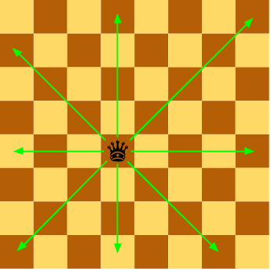

# Dues reines

Donades les posicions de les dues reines en un tauler d'escacs, digues si s'amenacen mútuament.



## Input

La entrada consisteix en 4 nombres indicant la  i  de cada reina

## Output

true | false

## Plantillas

```java
import java.io.*;
import java.util.*;
import java.text.*;
import java.math.*;
import java.util.regex.*;

public class Main {
    public static void main(String args[] ) throws Exception {
        /* Enter your code here. Read input from STDIN. Print output to STDOUT */
    }
}
```

## Tests

### Test
```input
4 4
6 6
```
```output
true
```

### Test
```input
4 4
4 6
```
```output
true
```

### Test
```input
3 5
7 5
```
```output
true
```

### Test
```input
2 2
5 3
```
```output
false
```

### Test
```input
3 3
5 5
```
```output
true
```

### Test
```input
5 5
3 3
```
```output
true
```

### Test
```input
2 6
5 3
```
```output
true
```

### Test
```input
5 3
2 6
```
```output
true
```

### Test
```input
1 2
7 8
```
```output
true
```

### Test
```input
7 8
1 2
```
```output
true
```

### Test
```input
4 8
7 3
```
```output
false
```
