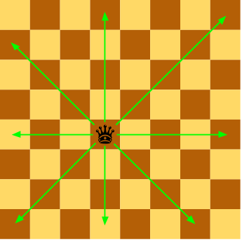

# Dues reines

Donades les posicions de les dues reines en un tauler d'escacs, digues si s'amenacen mútuament.

## Input

La entrada consisteix en 4 nombres indicant la  i  de cada reina

## Output

true | false
