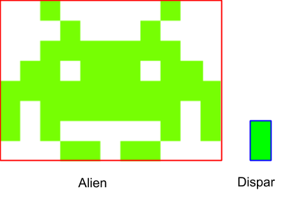

# Space Invaders

Es vol implementar un sistema de detecció de col·lisions per al joc Space Invaders.
Una de les col·lisions que s'haurà de detectar és quan un dispar dona en un alien.

El sistema de col·lisions haurà de determinar si el rectangle que envolta l'alien i el rectangle que envolta el dispar estan solapats



## Input

La entrada consisteix en la definició dels dos rectangles. Per a cada rectangle es determinen les coordenades (,) del seu canto inferior-esquerra, la seva amplada () i la seva alçada ().

## Output

true | false

## Tests

### Test 9.09
```input
2 3 4 2
0 0 1 2
```
```output
false
```

### Test 9.09
```input
2 3 4 2
0 0 1 2
```
```output
false
```

### Test private 9.09
```input
1 4 4 2
2 1 1 2
```
```output
false
```

### Test private 9.09
```input
1 2 4 2
2 1 1 2
```
```output
true
```

### Test private 9.09
```input
1 0 4 2
4 -1 1 2
```
```output
true
```

### Test private 9.09
```input
1 3 4 2
1 1 1 2
```
```output
false
```

### Test private 9.09
```input
1 1 4 3
2 2 1 1
```
```output
true
```

### Test private 9.09
```input
-2 -1 4 3
1 0 2 2
```
```output
true
```

### Test private 9.09
```input
20 -20 40 80
20 20 60 80
```
```output
true
```

### Test private 9.09
```input
0 0 10 10
0 0 10 10
```
```output
true
```

### Test private 9.1
```input
0 0 1 1
1 0 1 1
```
```output
false
```
