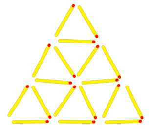
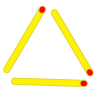
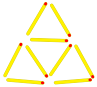
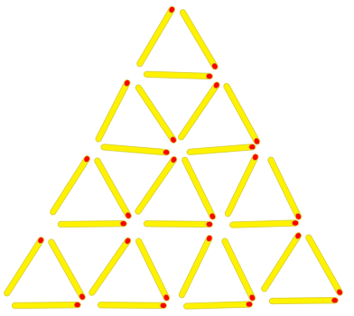

# Piràmides de llumins

Al meu oncle li agrada fer figures amb els llumins a les sobretaules, com aquesta piràmide:



Per a fer aquesta piràmide de 3 pisos li calen 18 llumins.

¿Quants llumins calen per fer piràmides de diferents alçades?

*[https://www.aceptaelreto.com/problem/statement.php?id=371](https://www.aceptaelreto.com/problem/statement.php?id=371)*

## Input

La entrada consta d'un número <span style="font-size: 100%; display: inline-block;" class="MathJax_SVG" id="MathJax-Element-1-Frame"><svg xmlns:xlink="http://www.w3.org/1999/xlink" width="2.064ex" height="2.176ex" style="vertical-align: -0.338ex;" viewBox="0 -791.3 888.5 936.9" role="img" focusable="false"><g stroke="currentColor" fill="currentColor" stroke-width="0" transform="matrix(1 0 0 -1 0 0)"><path stroke-width="1" d="M228 637Q194 637 192 641Q191 643 191 649Q191 673 202 682Q204 683 219 683Q260 681 355 681Q389 681 418 681T463 682T483 682Q499 682 499 672Q499 670 497 658Q492 641 487 638H485Q483 638 480 638T473 638T464 637T455 637Q416 636 405 634T387 623Q384 619 355 500Q348 474 340 442T328 395L324 380Q324 378 469 378H614L615 381Q615 384 646 504Q674 619 674 627T617 637Q594 637 587 639T580 648Q580 650 582 660Q586 677 588 679T604 682Q609 682 646 681T740 680Q802 680 835 681T871 682Q888 682 888 672Q888 645 876 638H874Q872 638 869 638T862 638T853 637T844 637Q805 636 794 634T776 623Q773 618 704 340T634 58Q634 51 638 51Q646 48 692 46H723Q729 38 729 37T726 19Q722 6 716 0H701Q664 2 567 2Q533 2 504 2T458 2T437 1Q420 1 420 10Q420 15 423 24Q428 43 433 45Q437 46 448 46H454Q481 46 514 49Q520 50 522 50T528 55T534 64T540 82T547 110T558 153Q565 181 569 198Q602 330 602 331T457 332H312L279 197Q245 63 245 58Q245 51 253 49T303 46H334Q340 38 340 37T337 19Q333 6 327 0H312Q275 2 178 2Q144 2 115 2T69 2T48 1Q31 1 31 10Q31 12 34 24Q39 43 44 45Q48 46 59 46H65Q92 46 125 49Q139 52 144 61Q147 65 216 339T285 628Q285 635 228 637Z"></path></g></svg></span> indicant l'alçada de la piràmide

## Output

El nombre de llumins necessaris per fer la piràmide.

## Tests

### Test
```input
1
```
```output
3
```
```explanation

```

### Test
```input
1
```
```output
3
```
```explanation
9

```

### Test
```input
2
```
```output
9
```
```explanation

```

### Test
```input
3
```
```output
18
```
```explanation

```

### Test
```input
4
```
```output
30
```

### Test
```input
5
```
```output
45
```

### Test
```input
6
```
```output
63
```

### Test
```input
10
```
```output
165
```

### Test
```input
50
```
```output
3825
```

### Test
```input
115
```
```output
20010
```

### Test
```input
800
```
```output
961200
```

### Test private
```input
999
```
```output
1498500
```
