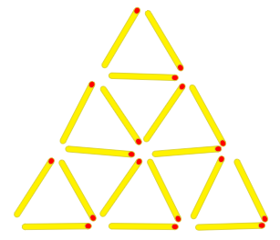

# Piràmides de llumins

Al meu oncle li agrada fer figures amb els llumins a les sobretaules, com aquesta piràmide:

Per a fer aquesta piràmide de 3 pisos li calen 18 llumins.

¿Quants llumins calen per fer piràmides de diferents alçades?

*[https://www.aceptaelreto.com/problem/statement.php?id=371](https://www.aceptaelreto.com/problem/statement.php?id=371)*

## Input

La entrada consta d'un número  indicant l'alçada de la piràmide

## Output

El nombre de llumins necessaris per fer la piràmide.
