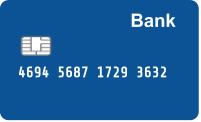

# Hardy-Ramanujan

Desde que va llegir sobre el matemàtic Ramanujan, busca el nombre 1729 per tot arreu: a les matrícules dels cotxes, als números de telèfon, a les tarjetes bancàries, ...

Especialment a les tarjetes busca que sigui un dels grups de nombres de 4 xifres.



## Input

La entrada consisteix en un nombre  de tarjeta bancària.

## Output

si el 1729 es un dels grups de 4 xifres

 si no ho és

## Tests

### Test 7.69
```input
1111222233334444
```
```output
false
```

### Test 7.69
```input
1111222233334444
```
```output
false
```

### Test private 7.69
```input
1111222233331729
```
```output
true
```

### Test private 7.69
```input
1111222217294444
```
```output
true
```

### Test private 7.69
```input
1111172933334444
```
```output
true
```

### Test private 7.69
```input
1729222233334444
```
```output
true
```

### Test private 7.69
```input
1117292233334444
```
```output
false
```

### Test private 7.69
```input
1111221729334444
```
```output
false
```

### Test private 7.69
```input
1111222233317294
```
```output
false
```

### Test private 7.69
```input
0
```
```output
false
```

### Test private 7.69
```input
0000000017290000
```
```output
true
```

### Test private 7.69
```input
0000000000001729
```
```output
true
```

### Test private 7.72
```input
1234567891234567
```
```output
false
```
