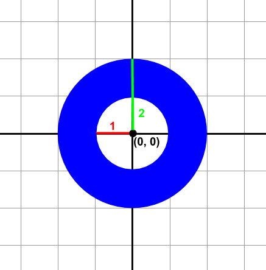

# Just a l'anella

A la fira hi ha una parada que té una anella penjada. Es tracta de tirar un dard, i si encertes en l'anella tens un premi.

## Input

La entrada consisteix en la definició de l'anella i la posició on s'ha clavat el dard.

L'anella es defineix per les coordenades del seu centre (, ), i les longituds dels radis interior () i exterior ().

Per exemple, la següent anella té el centre a (0,0), el radi interior 1, i l'exterior 2.



La posició del dard es defineix per les seves coordenades (, ).

## Output

si el dard s'ha clavat a l'anella

 en cas contrari

## Tests

### Test
```input
0 0 1 2 
0 0
```
```output
false
```

### Test
```input
0 0 1 2
0 0
```
```output
false
```

### Test
```input
0 0 1 2
1 1
```
```output
true
```

### Test
```input
1 0 1 2
0 -1
```
```output
true
```

### Test
```input
0 0 1 3
-2 1
```
```output
true
```

### Test
```input
0 0 2 3
1 -1
```
```output
false
```

### Test
```input
0 0 1 3
1 -1
```
```output
true
```

### Test
```input
3 3 3 4
3 -1
```
```output
false
```

### Test
```input
3 -1 3 5
3 3
```
```output
true
```

### Test
```input
73 27 25 60
99 3
```
```output
true
```

### Test
```input
73 7 16 25
87 33
```
```output
false
```
