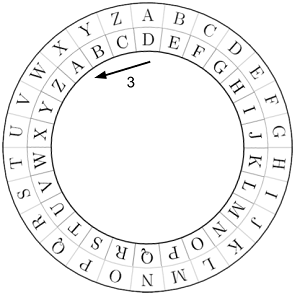
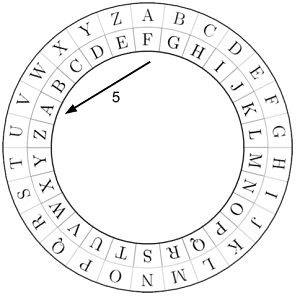
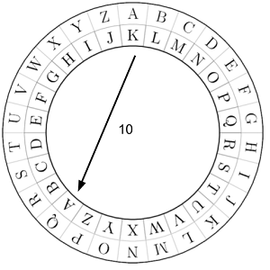
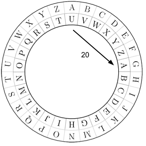
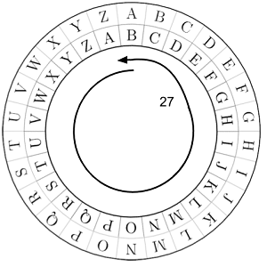

# Xifratge cèsar

En criptografia, el xifratge Cèsar, és un tipus de xifratge per substitució en el qual cada lletra del "text clar" es subsititueix per una altra lletra que estigui un determinat nombre fix de posicions desplaçades de l'alfabet. El nombre de posicions que s'ha de desplaçar cada lletra es coneix com a Clau.

## Input

La entrada consta d'una paraula de 4 caracters i una clau <span style="font-size: 100%; display: inline-block;" class="MathJax_SVG" id="MathJax-Element-1-Frame"><svg xmlns:xlink="http://www.w3.org/1999/xlink" width="2.066ex" height="2.176ex" style="vertical-align: -0.338ex;" viewBox="0 -791.3 889.5 936.9" role="img" focusable="false"><g stroke="currentColor" fill="currentColor" stroke-width="0" transform="matrix(1 0 0 -1 0 0)"><path stroke-width="1" d="M285 628Q285 635 228 637Q205 637 198 638T191 647Q191 649 193 661Q199 681 203 682Q205 683 214 683H219Q260 681 355 681Q389 681 418 681T463 682T483 682Q500 682 500 674Q500 669 497 660Q496 658 496 654T495 648T493 644T490 641T486 639T479 638T470 637T456 637Q416 636 405 634T387 623L306 305Q307 305 490 449T678 597Q692 611 692 620Q692 635 667 637Q651 637 651 648Q651 650 654 662T659 677Q662 682 676 682Q680 682 711 681T791 680Q814 680 839 681T869 682Q889 682 889 672Q889 650 881 642Q878 637 862 637Q787 632 726 586Q710 576 656 534T556 455L509 418L518 396Q527 374 546 329T581 244Q656 67 661 61Q663 59 666 57Q680 47 717 46H738Q744 38 744 37T741 19Q737 6 731 0H720Q680 3 625 3Q503 3 488 0H478Q472 6 472 9T474 27Q478 40 480 43T491 46H494Q544 46 544 71Q544 75 517 141T485 216L427 354L359 301L291 248L268 155Q245 63 245 58Q245 51 253 49T303 46H334Q340 37 340 35Q340 19 333 5Q328 0 317 0Q314 0 280 1T180 2Q118 2 85 2T49 1Q31 1 31 11Q31 13 34 25Q38 41 42 43T65 46Q92 46 125 49Q139 52 144 61Q147 65 216 339T285 628Z"></path></g></svg></span> de desplaçacament.

Tots els caracters són de l'alfabet anglès i en minúscules.

## Output

S'escriurà la paraula codificada.

## Tests

### Test
```input
beca
3
```
```output
ehfd
```
```explanation

```

### Test
```input
beca
3
```
```output
ehfd
```
```explanation

```

### Test
```input
beca
5
```
```output
gjhf
```
```explanation

```

### Test
```input
hola
10
```
```output
ryvk
```
```explanation

```

### Test
```input
java
20
```
```output
dupu
```
```explanation

```

### Test
```input
zeta
27
```
```output
afub
```
```explanation
76 = 26*3  => 3 voltes completes
```

### Test
```input
char
78
```
```output
char
```

### Test
```input
long
112
```
```output
twvo
```

### Test private
```input
byte
0
```
```output
byte
```
