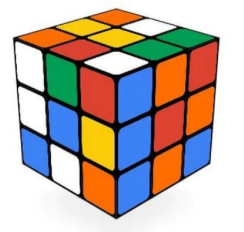

# Cub de Rubik

El cub de Rubik stàndard (de tamany 3) consisteix en 26 "cubies" o "cubelets" (a la part interior no hi ha cap cubelet).



Hi ha moltes altres variants del cub, amb tamanys i formes diferents.

## Input

La entrada consisteix en un nombre  indicant el tamany del cub.

## Output

S'imprimira el nombre de "cubelets" que té el cub.

## Tests

### Test 12.5
```input
3
```
```output
26
```

### Test 12.5
```input
3
```
```output
26
```

### Test private 12.5
```input
4
```
```output
56
```

### Test private 12.5
```input
5
```
```output
98
```

### Test private 12.5
```input
6
```
```output
152
```

### Test private 12.5
```input
10
```
```output
488
```

### Test private 12.5
```input
1000
```
```output
5988008
```

### Test private 12.5
```input
1000000
```
```output
5999988000008
```
