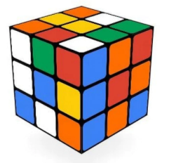

# Cub de Rubik

El cub de Rubik stàndard (de tamany 3) consisteix en 26 "cubies" o "cubelets" (a la part interior no hi ha cap cubelet).

Hi ha moltes altres variants del cub, amb tamanys i formes diferents.

## Input

La entrada consisteix en un nombre  indicant el tamany del cub.

## Output

S'imprimira el nombre de "cubelets" que té el cub.
