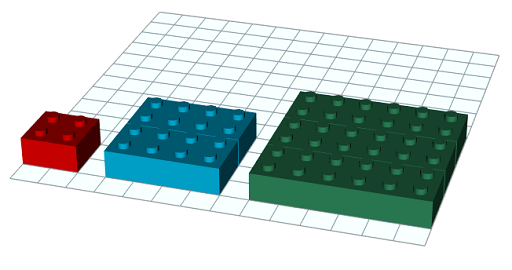

# Piràmide lego

Amb peces de lego de 4x4 pots construir piràmides com aquesta de 3 pisos:

Per a construir-la hem utilitzat 14 peces:

¿Quantes peces es necessiten per a construir un piràmide d'un determinat nombre de pisos?

## Input

La entrada consta d'un nombre de pisos

## Output

El nombre de peces necessàries
