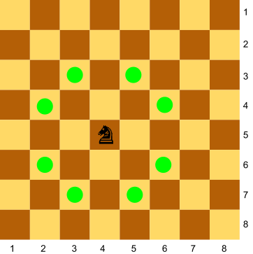

# Un cavall contra dos peons

Als escacs el cavall pot saltar fent una "L", així:



Donada la posició d'un cavall i de dos peons al tauler, digues quants peons està amenaçant el cavall.

## Input

La posició del cavall, i del dos peons

## Output

0 | 1 | 2

## Tests

### Test 12.5
```input
4 5
3 3
5 4
```
```output
1
```

### Test 12.5
```input
4 5
3 3
5 4
```
```output
1
```

### Test private 12.5
```input
4 5
2 4
6 4
```
```output
2
```

### Test private 12.5
```input
6 2
6 4
7 1
```
```output
0
```

### Test private 12.5
```input
1 1
2 3
3 2
```
```output
2
```

### Test private 12.5
```input
7 6
3 4
8 8
```
```output
1
```

### Test private 12.5
```input
3 5
2 2
1 1
```
```output
0
```

### Test private 12.5
```input
8 2
7 4
5 3
```
```output
1
```
