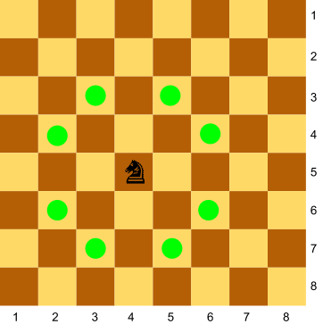

# Un cavall contra dos peons

Als escacs el cavall pot saltar fent una "L", així:

Donada la posició d'un cavall i de dos peons al tauler, digues quants peons està amenaçant el cavall.

## Input

La posició del cavall, i del dos peons

## Output

0 | 1 | 2
