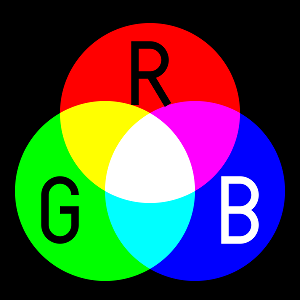

# Cercles RGB

RGB és un model de color additiu en el qual la llum vermella, verda i blava son mesclades per a reproduir colors. És el model que s'usa en pantalles, projectors, càmeres o scànners.



Fem un experiment emetent sobre una pared tres focus rodons -de diferents tamanys i posicions- de llum vermella, verda i blava.

¿Quants colors distints veurem?

## Input

La entrada consisteix en la definició dels 3 cercles RGB.

Cada cercle es defineix per les coordinades del seu centre (, )
i la longitud del seu radi .

## Output

El nombre de colors distints que es veuran.

## Tests

### Test 7.14
```input
0 0 1
1 0 1
2 0 1
```
```output
5
```

### Test 7.14
```input
0 0 1
1 0 1
2 0 1
```
```output
5
```

### Test private 7.14
```input
0 0 1
1 0 1
3 0 1
```
```output
4
```

### Test private 7.14
```input
0 0 1
2 0 1
4 0 1
```
```output
3
```

### Test private 7.14
```input
1 0 4
2 0 2
0 0 2
```
```output
4
```

### Test private 7.14
```input
1 0 2
3 0 1
0 0 1
```
```output
4
```

### Test private 7.14
```input
0 1 1
1 0 1
1 1 1
```
```output
7
```

### Test private 7.14
```input
0 0 4
4 0 3
4 0 2
```
```output
5
```

### Test private 7.14
```input
0 0 4
0 0 3
0 0 2
```
```output
3
```

### Test private 7.14
```input
0 0 4
2 0 3
2 0 1
```
```output
4
```

### Test private 7.14
```input
0 0 4
2 0 3
4 0 2
```
```output
6
```

### Test private 7.14
```input
0 0 4
6 0 4
3 0 2
```
```output
6
```

### Test private 7.14
```input
0 4 4
6 2 3
5 6 2
```
```output
6
```

### Test private 7.18
```input
2 0 4
4 0 2
0 0 2
```
```output
3
```
