# Cercles RGB

RGB és un model de color additiu en el qual la llum vermella, verda i blava son mesclades per a reproduir colors. És el model que s'usa en pantalles, projectors, càmeres o scànners.


Fem un experiment emetent sobre una pared tres focus rodons -de diferents tamanys i posicions- de llum vermella, verda i blava.

¿Quants colors distints veurem?

## Input

La entrada consisteix en la definició dels 3 cercles RGB. 

Cada cercle es defineix per les coordinades del seu centre (<span style="font-size: 100%; display: inline-block;" class="MathJax_SVG" id="MathJax-Element-1-Frame"><svg xmlns:xlink="http://www.w3.org/1999/xlink" width="1.98ex" height="2.176ex" style="vertical-align: -0.338ex;" viewBox="0 -791.3 852.5 936.9" role="img" focusable="false"><g stroke="currentColor" fill="currentColor" stroke-width="0" transform="matrix(1 0 0 -1 0 0)"><path stroke-width="1" d="M42 0H40Q26 0 26 11Q26 15 29 27Q33 41 36 43T55 46Q141 49 190 98Q200 108 306 224T411 342Q302 620 297 625Q288 636 234 637H206Q200 643 200 645T202 664Q206 677 212 683H226Q260 681 347 681Q380 681 408 681T453 682T473 682Q490 682 490 671Q490 670 488 658Q484 643 481 640T465 637Q434 634 411 620L488 426L541 485Q646 598 646 610Q646 628 622 635Q617 635 609 637Q594 637 594 648Q594 650 596 664Q600 677 606 683H618Q619 683 643 683T697 681T738 680Q828 680 837 683H845Q852 676 852 672Q850 647 840 637H824Q790 636 763 628T722 611T698 593L687 584Q687 585 592 480L505 384Q505 383 536 304T601 142T638 56Q648 47 699 46Q734 46 734 37Q734 35 732 23Q728 7 725 4T711 1Q708 1 678 1T589 2Q528 2 496 2T461 1Q444 1 444 10Q444 11 446 25Q448 35 450 39T455 44T464 46T480 47T506 54Q523 62 523 64Q522 64 476 181L429 299Q241 95 236 84Q232 76 232 72Q232 53 261 47Q262 47 267 47T273 46Q276 46 277 46T280 45T283 42T284 35Q284 26 282 19Q279 6 276 4T261 1Q258 1 243 1T201 2T142 2Q64 2 42 0Z"></path></g></svg></span>, <span style="font-size: 100%; display: inline-block;" class="MathJax_SVG" id="MathJax-Element-2-Frame"><svg xmlns:xlink="http://www.w3.org/1999/xlink" width="1.773ex" height="2.009ex" style="vertical-align: -0.171ex;" viewBox="0 -791.3 763.5 865.1" role="img" focusable="false"><g stroke="currentColor" fill="currentColor" stroke-width="0" transform="matrix(1 0 0 -1 0 0)"><path stroke-width="1" d="M66 637Q54 637 49 637T39 638T32 641T30 647T33 664T42 682Q44 683 56 683Q104 680 165 680Q288 680 306 683H316Q322 677 322 674T320 656Q316 643 310 637H298Q242 637 242 624Q242 619 292 477T343 333L346 336Q350 340 358 349T379 373T411 410T454 461Q546 568 561 587T577 618Q577 634 545 637Q528 637 528 647Q528 649 530 661Q533 676 535 679T549 683Q551 683 578 682T657 680Q684 680 713 681T746 682Q763 682 763 673Q763 669 760 657T755 643Q753 637 734 637Q662 632 617 587Q608 578 477 424L348 273L322 169Q295 62 295 57Q295 46 363 46Q379 46 384 45T390 35Q390 33 388 23Q384 6 382 4T366 1Q361 1 324 1T232 2Q170 2 138 2T102 1Q84 1 84 9Q84 14 87 24Q88 27 89 30T90 35T91 39T93 42T96 44T101 45T107 45T116 46T129 46Q168 47 180 50T198 63Q201 68 227 171L252 274L129 623Q128 624 127 625T125 627T122 629T118 631T113 633T105 634T96 635T83 636T66 637Z"></path></g></svg></span>)
i la longitud del seu radi <span style="font-size: 100%; display: inline-block;" class="MathJax_SVG" id="MathJax-Element-3-Frame"><svg xmlns:xlink="http://www.w3.org/1999/xlink" width="1.764ex" height="2.176ex" style="vertical-align: -0.338ex;" viewBox="0 -791.3 759.5 936.9" role="img" focusable="false"><g stroke="currentColor" fill="currentColor" stroke-width="0" transform="matrix(1 0 0 -1 0 0)"><path stroke-width="1" d="M230 637Q203 637 198 638T193 649Q193 676 204 682Q206 683 378 683Q550 682 564 680Q620 672 658 652T712 606T733 563T739 529Q739 484 710 445T643 385T576 351T538 338L545 333Q612 295 612 223Q612 212 607 162T602 80V71Q602 53 603 43T614 25T640 16Q668 16 686 38T712 85Q717 99 720 102T735 105Q755 105 755 93Q755 75 731 36Q693 -21 641 -21H632Q571 -21 531 4T487 82Q487 109 502 166T517 239Q517 290 474 313Q459 320 449 321T378 323H309L277 193Q244 61 244 59Q244 55 245 54T252 50T269 48T302 46H333Q339 38 339 37T336 19Q332 6 326 0H311Q275 2 180 2Q146 2 117 2T71 2T50 1Q33 1 33 10Q33 12 36 24Q41 43 46 45Q50 46 61 46H67Q94 46 127 49Q141 52 146 61Q149 65 218 339T287 628Q287 635 230 637ZM630 554Q630 586 609 608T523 636Q521 636 500 636T462 637H440Q393 637 386 627Q385 624 352 494T319 361Q319 360 388 360Q466 361 492 367Q556 377 592 426Q608 449 619 486T630 554Z"></path></g></svg></span>.

## Output

El nombre de colors distints que es veuran.

## Tests

### Test
```input
0 0 1
1 0 1
2 0 1
```
```output
5
```
```explanation
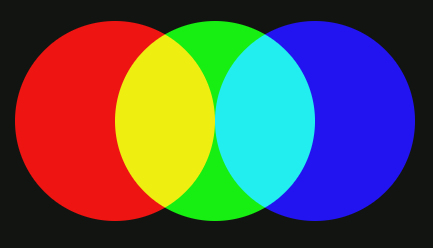
```

### Test
```input
0 0 1
1 0 1
2 0 1
```
```output
5
```
```explanation
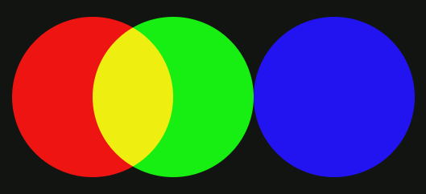
```

### Test
```input
0 0 1
1 0 1
3 0 1
```
```output
4
```
```explanation
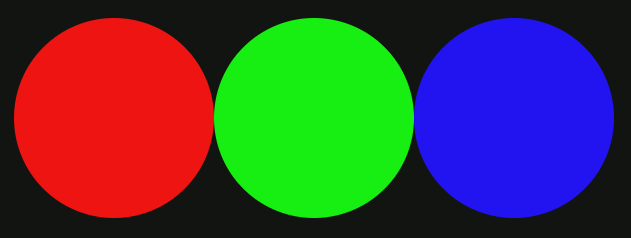
```

### Test
```input
0 0 1
2 0 1
4 0 1
```
```output
3
```
```explanation
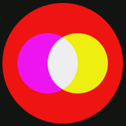
```

### Test
```input
1 0 4
2 0 2
0 0 2
```
```output
4
```
```explanation
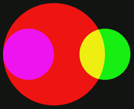
```

### Test
```input
1 0 2
3 0 1
0 0 1
```
```output
4
```
```explanation
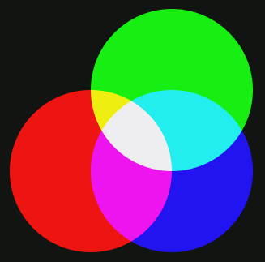
```

### Test
```input
0 1 1
1 0 1
1 1 1
```
```output
7
```
```explanation
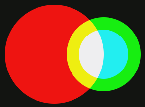
```

### Test
```input
0 0 4
4 0 3
4 0 2
```
```output
5
```
```explanation
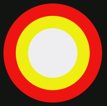
```

### Test
```input
0 0 4
0 0 3
0 0 2
```
```output
3
```
```explanation
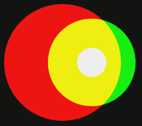
```

### Test
```input
0 0 4
2 0 3
2 0 1
```
```output
4
```
```explanation
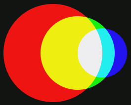
```

### Test
```input
0 0 4
2 0 3
4 0 2
```
```output
6
```
```explanation
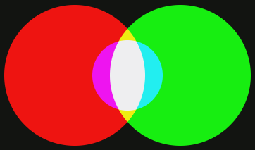
```

### Test
```input
0 0 4
6 0 4
3 0 2
```
```output
6
```
```explanation
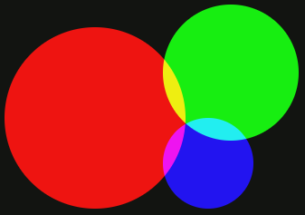
```

### Test
```input
0 4 4
6 2 3
5 6 2
```
```output
6
```
```explanation
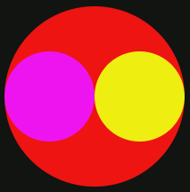
```

### Test private
```input
2 0 4
4 0 2
0 0 2
```
```output
3
```
