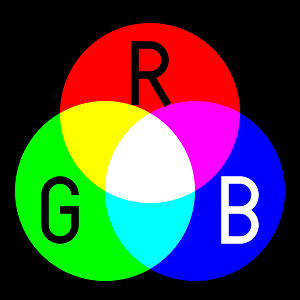

# Cercles RGB

RGB és un model de color additiu en el qual la llum vermella, verda i blava son mesclades per a reproduir colors. És el model que s'usa en pantalles, projectors, càmeres o scànners.

Fem un experiment emetent sobre una pared tres focus rodons -de diferents tamanys i posicions- de llum vermella, verda i blava.

¿Quants colors distints veurem?

## Input

La entrada consisteix en la definició dels 3 cercles RGB.

Cada cercle es defineix per les coordinades del seu centre (, )
i la longitud del seu radi .

## Output

El nombre de colors distints que es veuran.
