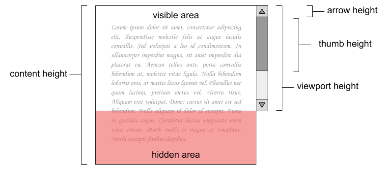

# Scrollbar

Quan el *content height* és major que el *viewport height*, el navegador web mostra una *scrollbar* amb dues *arrows* i un *thumb* per a poder desplaçar el contingut.

Per cada píxel que es desplaça el *thumb*, el contingut es desplaça proporcionalment en direcció oposada.

Per a implementar una *scrollbar* és necessari calcular el *thumb height* (de forma que el segment de desplaçament i el *thumb* mantenguin la proporció amb el *viewport* i el contingut) i el desplaçament del contingut per cada píxel que es desplaça el *thumb* (*scroll jump*).

## Input

La entrada consisteix en tres nombres:

- viewport height

- content height

- arrow height

## Output

S'imprimirà el *thumb height* i el *scroll jump*, arrodonits sense decimals.
