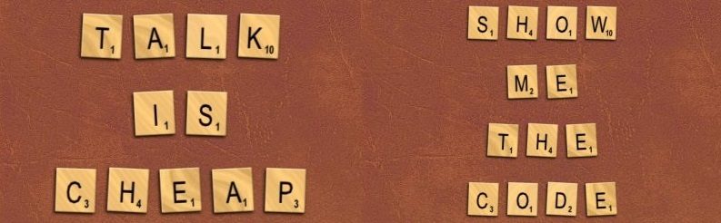

# Lletres de l'Scrabble



Donada una lletra, obté la seva puntuació d'Scrabble.

```text
Letter                             Value
A, E, I, O, U, L, N, R, S, T       1
D, G                               2
B, C, M, P                         3
F, H, V, W, Y                      4
K                                  5
J, X                               8
Q, Z                               10
```

## Input

Un caracter

El caracter és una lletra de l'Scrabble

## Output

La puntuació de la lletra
