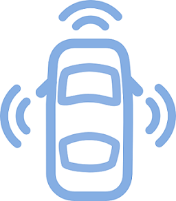

# Cotxes autònoms

Els cotxes autònoms ha de prendre decisions sobre la conducció a partir del les dades que perceben els seus sensors de l'entorn.



El nostre cotxe elèctric ha de decidir si pot continuar la marxa en funció de les dades que li arriben del sensors. Aquestes dades són:

- Estat del semàfor: r = vermell, g = verd, o = àmbar

- Vianants creuant el carrer: true, false

- Agent de circulació: 0 = no hi ha agent, 1 = ens dona pas, 2 = ens fa stop

La decisió de continuar o no, en base a les combinacions de les dades del sensor es reflecteix en aquesta taula:

```text
semafor   r r r r r r g g g g g g o o o o o o
vianants  f f f t t t f f f t t t f f f t t t
agent     0 1 2 0 1 2 0 1 2 0 1 2 0 1 2 0 1 2
---------------------------------------------
creuar    f t f f f f t t f f f f t t f f f f
```

## Input

En primer lloc l'estat del semàfor S, després la presència de vianants V, finalment l'estat de l'agent de circulació A.

S = { r | g | b}

V = { true | false }

A = { 0 | 1 | 2 }

## Output

S'imprimirà "CONTINUAR" o "NO CONTINUAR"
