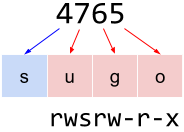

# Permisos octals UNIX

Donats els permisos d'un fitxer en format octal, tradueix-los a format caràcters.

La primera xifra octal indica els permisos especials: setuid, setgid i sticky.
La segona xifra octal indica els permisos rwx per a l'usuari propietari del fitxer.
La tercera xifra octal indica els permisos rwx per als usuaris del grup propietari del fitxer.
La quarta xifra octal indica els permisos rwx per a la resta d'usuaris.

Per exemple, el nombre octal 4765 indica que els permisos especials són 4, el d'usuari 7, el de grup 6 i per als altres 5. Això es tradueix en uns permisos rwsrw-r-x



Per a traduir el permisos octals en els permisos **rwx** corresponents, cal passar cada xifra a binari.

Per als permisos d'usuari, grup i altres, un 0 en la primera i segona xifra binària siginifica que el permisos de lectura i espcriptura, respectivament, no es concedeixen, i un 1 que sí es concedeixen.
Per al permís d'execució, un 0 significa que no es concedeix, i un 1 que sí es concedeix. A més a més, si es concedeix el permís d'execució i també i hi ha un 1 en la xifra binària especial corresponent, aleshores s'aplica el permís especial.


```text
usuari:
    r: lectura
    w: escriptura
    x: execució
    s: setuid
    S: setuid però no execució

grup:
    r: lectura
    w: escriptura
    x: execució
    s: setuid
    S: setuid però no execució
altres
    r: lectura
    w: escriptura
    x: execució
    t: sticky
    T: sticky però no execució
```

## Input

La entrada consisteix en un nombre octal P indicant els permisos.

0 <= P <= 7777

## Output

S'imprimiran els permisos en format caràcter.
