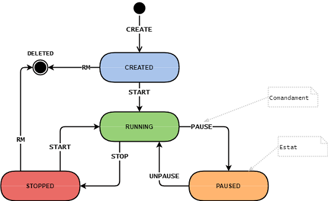

# Contenidors

Els contenidors són entorns d'execució aïllats que només tenen accés als recursos (cpu, memòria, sistema d'arxius, xarxa, etc.) que li són assignats.

Existeixen moltes solucions de software que permeten el maneig de contenidors (crear, iniciar, parar, eliminar...).

Una forma habitual de gestionar els contenidors és a través de comandaments. Per exemple, el comandament START inicia un contenidor, i STOP l'atura. És clar, que un contenidor ha d'estar un estat adequat per a poder enviar-li un comandament. Per exemple, no es pot aturar un contenidor que no estigui en execució.

El següent diagrama ilustra els estats en els que pot estar un contenidor, i els comandaments que es poden executar sobre ell, canviant el seu estat.



Es requereix crear un programa per a gestionar els estats d'un contenidor a través de comandaments.

## Input

La entrada consisteix en un estat i un comandament.

Un contenidor que encara no existeix s'indica amb l'estat '_'

estat = { _ | CREATED | RUNNING | PAUSED | STOPPED }

comandament = { CREATE | START | PAUSE | UNPAUSE | STOP | RM }

## Output

S'indicarà l'estat en que ha de quedar el contenidor si el comandament es pot realitzar.
Si no es pot realitzar, s'indicarà amb el missatge d'error "Invalid command  for state "

## Tests

### Test
```input
_  CREATE
```
```output
CREATED
```

### Test
```input
_  CREATE
```
```output
CREATED
```

### Test
```input
_  START
```
```output
Invalid command START for state _
```

### Test
```input
_  PAUSE
```
```output
Invalid command PAUSE for state _
```

### Test
```input
_  UNPAUSE
```
```output
Invalid command UNPAUSE for state _
```

### Test
```input
_  STOP
```
```output
Invalid command STOP for state _
```

### Test
```input
_  RM
```
```output
Invalid command RM for state _
```

### Test
```input
CREATED  CREATE
```
```output
Invalid command CREATE for state CREATED
```

### Test
```input
CREATED  START
```
```output
RUNNING
```

### Test
```input
CREATED  PAUSE
```
```output
Invalid command PAUSE for state CREATED
```

### Test
```input
CREATED  UNPAUSE
```
```output
Invalid command UNPAUSE for state CREATED
```

### Test
```input
CREATED  STOP
```
```output
Invalid command STOP for state CREATED
```

### Test
```input
CREATED  RM
```
```output
DELETED
```

### Test
```input
RUNNING  CREATE
```
```output
Invalid command CREATE for state RUNNING
```

### Test
```input
RUNNING  START
```
```output
Invalid command START for state RUNNING
```

### Test
```input
RUNNING  PAUSE
```
```output
PAUSED
```

### Test
```input
RUNNING  UNPAUSE
```
```output
Invalid command UNPAUSE for state RUNNING
```

### Test
```input
RUNNING  STOP
```
```output
STOPPED
```

### Test
```input
RUNNING  RM
```
```output
Invalid command RM for state RUNNING
```

### Test
```input
PAUSED  CREATE
```
```output
Invalid command CREATE for state PAUSED
```

### Test
```input
PAUSED  START
```
```output
Invalid command START for state PAUSED
```

### Test
```input
PAUSED  PAUSE
```
```output
Invalid command PAUSE for state PAUSED
```

### Test
```input
PAUSED  UNPAUSE
```
```output
RUNNING
```

### Test
```input
PAUSED  STOP
```
```output
Invalid command STOP for state PAUSED
```

### Test
```input
PAUSED  RM
```
```output
Invalid command RM for state PAUSED
```

### Test
```input
STOPPED  CREATE
```
```output
Invalid command CREATE for state STOPPED
```

### Test
```input
STOPPED  START
```
```output
RUNNING
```

### Test
```input
STOPPED  PAUSE
```
```output
Invalid command PAUSE for state STOPPED
```

### Test
```input
STOPPED  UNPAUSE
```
```output
Invalid command UNPAUSE for state STOPPED
```

### Test
```input
STOPPED  STOP
```
```output
Invalid command STOP for state STOPPED
```

### Test
```input
STOPPED  RM
```
```output
DELETED
```
