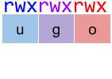

# Permisos UNIX

Els permisos de lecture, escritura i execució sobre fitxers en sistemes UNIX-like són gestionats en tres classes: usuari, grup i altres.

Els fitxers són propietat d'un usuari i d'un grup, i s'especifiquen permisos per a les tres classes: propietari del fitxer, els usuaris del grup propietari del fitxer i la resta d'usuaris.

Quan un usuari tracta d'accedir a un fitxer, els permisos efectius que té sobre el fitxer es determinen en base a la primera classe en la qual encaixi.

Donats els permisos, i l'usuari i grup propietaris d'un fitxer, calcula els permisos efectius que tindrà un usuari determinat sobre un fitxer.

## Input

A la primera línia venen els 9 permisos P, separats per espais en blanc, i l'usuari i grup propietaris.

A la segona línia ve l'usuari que tracta d'accedir al fitxer, i els 3 grups als que pertany.

P = { - | r | w | x }

L'usuari pertany sempre a 3 grups.

## Output

S'imprimiran els permisos efectius
