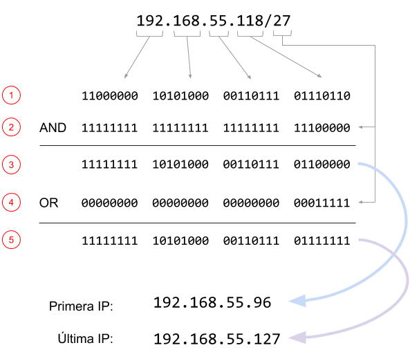

# Xarxes privades

A l'arquitectura d'adreçament d'Internet, una xarxa privada és una xarxa que utilitza l'espai d'adreces IP privades:

- 10.0.0.0 - 10.255.255.255

- 172.16.0.0 - 172.31.255.255

- 192.168.0.0 - 192.168.255.255

Les adreces privades no s'asignen a cap organització concreta i qualsevol persona pot utilitzar aquestes adreces sense l'aprovació d'un Registre Regional d'Internet.

La xarxa a la que pertany un ordinador es calcula a partir de la seva IP i la seva màscara de xarxa:

- Es passa cada nombre de la ip a un octet binari, i es coloquen consecutivament els quatre octets.

- Es crea un nombre binari amb tants 1 com indica la màscara i es completa amb 0 fins a 32 bits.

- Es realitza la operació AND entre el primer i el segon nombre. El valor resultant és la IP on comença la xarxa

- Es crea un nombre binari amb tants 0 com indica la màscara i es completa amb 1 fins a 32 bits.

- Es realitza la operació OR entre el primer i el segon nombre. El valor resultant és la IP on acaba la xarxa



## Input

La entrada consta dels quatre octets d'una adreça IP i una màscara de xarxa, separats per espais en blanc.

La IP i la màscara són vàlides

## Output

S'imprimirà la primera adreça de la xarxa, la última adreça, i s'indicarà si és una adreça pública o privada.

## Tests

### Test
```input
192 168 55 118
11
```
```output
First IP: 192.160.0.0
Last IP: 192.191.255.255
Public
```

### Test
```input
192 168 55 118
24
```
```output
First IP: 192.168.55.0
Last IP: 192.168.55.255
Private
```

### Test
```input
192 168 55 118
11
```
```output
First IP: 192.160.0.0
Last IP: 192.191.255.255
Public
```

### Test
```input
10 2 2 1
11
```
```output
First IP: 10.0.0.0
Last IP: 10.31.255.255
Private
```

### Test
```input
172 16 2 1
22
```
```output
First IP: 172.16.0.0
Last IP: 172.16.3.255
Private
```

### Test
```input
35 16 23 214
24
```
```output
First IP: 35.16.23.0
Last IP: 35.16.23.255
Public
```

### Test
```input
35 16 23 214
8
```
```output
First IP: 35.0.0.0
Last IP: 35.255.255.255
Public
```

### Test
```input
8 8 8 8
30
```
```output
First IP: 8.8.8.8
Last IP: 8.8.8.11
Public
```

### Test
```input
172 32 16 0
12
```
```output
First IP: 172.32.0.0
Last IP: 172.47.255.255
Public
```

### Test
```input
172 15 255 0
22
```
```output
First IP: 172.15.252.0
Last IP: 172.15.255.255
Public
```

### Test
```input
10 0 0 1
6
```
```output
First IP: 8.0.0.0
Last IP: 11.255.255.255
Public
```

### Test
```input
235 84 63 17
19
```
```output
First IP: 235.84.32.0
Last IP: 235.84.63.255
Public
```
