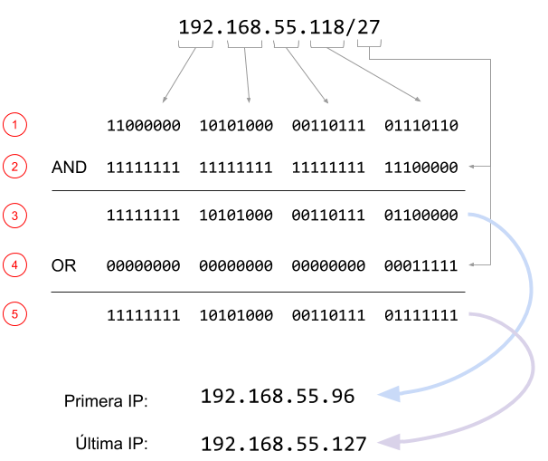

# Xarxes privades

A l'arquitectura d'adreçament d'Internet, una xarxa privada és una xarxa que utilitza l'espai d'adreces IP privades:

- 10.0.0.0 - 10.255.255.255

- 172.16.0.0 - 172.31.255.255

- 192.168.0.0 - 192.168.255.255

Les adreces privades no s'asignen a cap organització concreta i qualsevol persona pot utilitzar aquestes adreces sense l'aprovació d'un Registre Regional d'Internet.

La xarxa a la que pertany un ordinador es calcula a partir de la seva IP i la seva màscara de xarxa:

- Es passa cada nombre de la ip a un octet binari, i es coloquen consecutivament els quatre octets.

- Es crea un nombre binari amb tants 1 com indica la màscara i es completa amb 0 fins a 32 bits.

- Es realitza la operació AND entre el primer i el segon nombre. El valor resultant és la IP on comença la xarxa

- Es crea un nombre binari amb tants 0 com indica la màscara i es completa amb 1 fins a 32 bits.

- Es realitza la operació OR entre el primer i el segon nombre. El valor resultant és la IP on acaba la xarxa

## Input

La entrada consta dels quatre octets d'una adreça IP i una màscara de xarxa, separats per espais en blanc.

La IP i la màscara són vàlides

## Output

S'imprimirà la primera adreça de la xarxa, la última adreça, i s'indicarà si és una adreça pública o privada.
