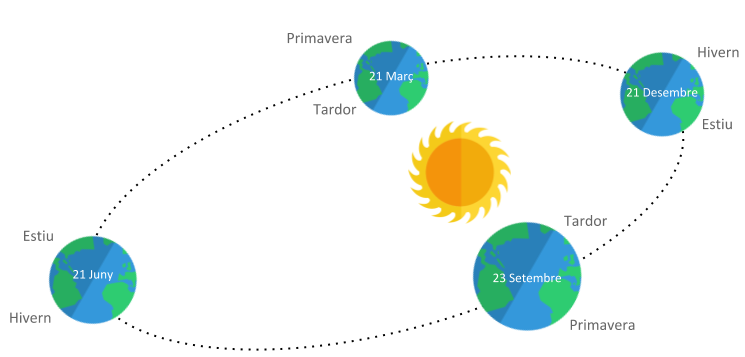

# Les quatre estacions

Les quatre estacions tradicionals tenen el seu inici i final marcats per esdeveniments astronòmics:

- Hivern: entre el solstici d'hivern i l'equinocci de primavera.

- Primavera: entre l'equinocci de primavera i el solstici d'estiu.

- Estiu: entre el solstici d'estiu i l'equinocci de tardor.

- Tardor: entre l'equinocci de tardor i el solstici d'hivern.

A l'hemisferi sud hivern-estiu i primavera-tardor estan invertits



## Input

La entrada consta d'un dia i mes de l'any.

Les dates són vàlides

## Output

S'imprimirà l'estació corresponent a l'hemisferi nord i a l'hemisferi sud.

## Tests

### Test 5.56
```input
21 3
```
```output
Primavera
Tardor
```

### Test 5.56
```input
21 12
```
```output
Hivern
Estiu
```

### Test private 5.56
```input
21 3
```
```output
Primavera
Tardor
```

### Test private 5.56
```input
21 6
```
```output
Estiu
Hivern
```

### Test private 5.56
```input
23 9
```
```output
Tardor
Primavera
```

### Test private 5.56
```input
20 12
```
```output
Tardor
Primavera
```

### Test private 5.56
```input
22 12
```
```output
Hivern
Estiu
```

### Test private 5.56
```input
20 3
```
```output
Hivern
Estiu
```

### Test private 5.56
```input
22 3
```
```output
Primavera
Tardor
```

### Test private 5.56
```input
20 6
```
```output
Primavera
Tardor
```

### Test private 5.56
```input
22 6
```
```output
Estiu
Hivern
```

### Test private 5.56
```input
22 9
```
```output
Estiu
Hivern
```

### Test private 5.56
```input
24 9
```
```output
Tardor
Primavera
```

### Test private 5.56
```input
15 1
```
```output
Hivern
Estiu
```

### Test private 5.56
```input
23 5
```
```output
Primavera
Tardor
```

### Test private 5.56
```input
21 7
```
```output
Estiu
Hivern
```

### Test private 5.56
```input
27 10
```
```output
Tardor
Primavera
```

### Test private 5.48
```input
30 1
```
```output
Hivern
Estiu
```
