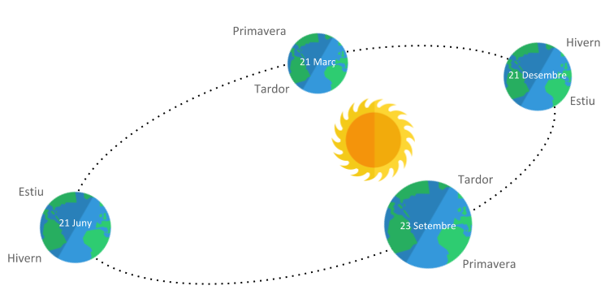

# Les quatre estacions

Les quatre estacions tradicionals tenen el seu inici i final marcats per esdeveniments astronòmics:

- Hivern: entre el solstici d'hivern i l'equinocci de primavera.

- Primavera: entre l'equinocci de primavera i el solstici d'estiu.

- Estiu: entre el solstici d'estiu i l'equinocci de tardor.

- Tardor: entre l'equinocci de tardor i el solstici d'hivern.

A l'hemisferi sud hivern-estiu i primavera-tardor estan invertits

## Input

La entrada consta d'un dia i mes de l'any.

Les dates són vàlides

## Output

S'imprimirà l'estació corresponent a l'hemisferi nord i a l'hemisferi sud.
