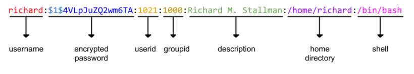

# passwd



L'arxiu /etc/passwd emmagatzema els usuaris del sistema. Cada línia conté la informació d'un usuari i té els següents camps:

- Username

- Encrypted password. *Tradicionalment, aquest camp contenia el password encriptat de l'usuari. Els sistemes Unix moderns, guarden els passwords encriptats en un arxiu separat (/etc/shadow) que només pot ser accedit per usuaris privilegiats*

- User identification number (UID)

- Group identification number (GID)

- Full name

- Home directory

- Shell

Realitzarem un programa que permeti generar automàticament una sèrie d'usuaris amb el format de l'ariux passwd. Les dades dels usuaris es generaran d'aquesta forma1:

- :  serà la paraula 'user' seguit de l' de l'usuari

-  :  usarem una funció HASH sencilla per a generar un password a partir de l'UID. Després encryptarem el password generat amb l'algoritme MD5.

- :  es generarà de forma consecutiva a partir del 1001

- :  serà sempre 1000

- :  La paraula "Usuari" + espai en blanc +

- :  /home/

- :  /bin/bash

**Encriptació del password**

El password serà un número que es generarà a partir de l'UID de l'usuari, usant aquesta funció HASH:

```text
HASH(UID) = (UID >> 1
```

Un cop generat el password, l'encriptarem amb l'algoritme MD5 que implementa el paquet java.security.MessageDigest:

```text
String encrypted = Base64.getEncoder().encodeToString(MessageDigest.getInstance("md5").digest((String.valueOf(password)).getBytes()));
```

* la variable  és el número que s'ha generat a partir de l'UID

Finalment, a l'arxiu /etc/passwd **cal indicar quin és l'algoritme utilitzat**. En el cas d'MD5 s'indica amb la marca  just davant del password encryptat.

NOTES:

*(1) L'algoritme MD5 implementat a MessageDigest NO és compatible amb l'algoritme que usa GNU/Linux*

*(2) L'algoritme MD5 no és segur, caldria utilitzar SHA-512*

*(3) Generar contrasenyes a partir de dades conegudes, com l'UID, no és segur. Cal generar contrasenyes aleatòries.*

## Input

L'entrada consta d'un nombre enter que indica la quantitat d'usuaris a generar.

## Output

S'imprimiràn les dades dels usuaris amb el format de la l'arxiu /etc/passwd.
