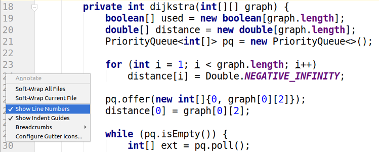

# Show line numbers



Necessitem incorporar la funció "Show line numbers" al nostre editor de codi...

## Input

L'entrada és un codi font en vàries línies.

El codi font acaba amb la paraula <span style="font-size: 100%; display: inline-block;" class="MathJax_SVG" id="MathJax-Element-1-Frame"><svg xmlns:xlink="http://www.w3.org/1999/xlink" width="5.764ex" height="2.176ex" style="vertical-align: -0.338ex;" viewBox="0 -791.3 2481.5 936.9" role="img" focusable="false"><g stroke="currentColor" fill="currentColor" stroke-width="0" transform="matrix(1 0 0 -1 0 0)"><path stroke-width="1" d="M492 213Q472 213 472 226Q472 230 477 250T482 285Q482 316 461 323T364 330H312Q311 328 277 192T243 52Q243 48 254 48T334 46Q428 46 458 48T518 61Q567 77 599 117T670 248Q680 270 683 272Q690 274 698 274Q718 274 718 261Q613 7 608 2Q605 0 322 0H133Q31 0 31 11Q31 13 34 25Q38 41 42 43T65 46Q92 46 125 49Q139 52 144 61Q146 66 215 342T285 622Q285 629 281 629Q273 632 228 634H197Q191 640 191 642T193 659Q197 676 203 680H757Q764 676 764 669Q764 664 751 557T737 447Q735 440 717 440H705Q698 445 698 453L701 476Q704 500 704 528Q704 558 697 578T678 609T643 625T596 632T532 634H485Q397 633 392 631Q388 629 386 622Q385 619 355 499T324 377Q347 376 372 376H398Q464 376 489 391T534 472Q538 488 540 490T557 493Q562 493 565 493T570 492T572 491T574 487T577 483L544 351Q511 218 508 216Q505 213 492 213Z"></path><g transform="translate(764,0)"><path stroke-width="1" d="M234 637Q231 637 226 637Q201 637 196 638T191 649Q191 676 202 682Q204 683 299 683Q376 683 387 683T401 677Q612 181 616 168L670 381Q723 592 723 606Q723 633 659 637Q635 637 635 648Q635 650 637 660Q641 676 643 679T653 683Q656 683 684 682T767 680Q817 680 843 681T873 682Q888 682 888 672Q888 650 880 642Q878 637 858 637Q787 633 769 597L620 7Q618 0 599 0Q585 0 582 2Q579 5 453 305L326 604L261 344Q196 88 196 79Q201 46 268 46H278Q284 41 284 38T282 19Q278 6 272 0H259Q228 2 151 2Q123 2 100 2T63 2T46 1Q31 1 31 10Q31 14 34 26T39 40Q41 46 62 46Q130 49 150 85Q154 91 221 362L289 634Q287 635 234 637Z"></path></g><g transform="translate(1653,0)"><path stroke-width="1" d="M287 628Q287 635 230 637Q207 637 200 638T193 647Q193 655 197 667T204 682Q206 683 403 683Q570 682 590 682T630 676Q702 659 752 597T803 431Q803 275 696 151T444 3L430 1L236 0H125H72Q48 0 41 2T33 11Q33 13 36 25Q40 41 44 43T67 46Q94 46 127 49Q141 52 146 61Q149 65 218 339T287 628ZM703 469Q703 507 692 537T666 584T629 613T590 629T555 636Q553 636 541 636T512 636T479 637H436Q392 637 386 627Q384 623 313 339T242 52Q242 48 253 48T330 47Q335 47 349 47T373 46Q499 46 581 128Q617 164 640 212T683 339T703 469Z"></path></g></g></svg></span>

## Output

S'imprimirà el mateix codi font, però amb el número de línia a l'inici de cada línia; amb aquest format:

El número de línia ocuparà dos caràcters, després hi haurà un espai en blanc, després una barra vertical i després un altre espai.

## Tests

### Test
```input
hola
END
```
```output
 1 | hola
```

### Test
```input
if(b[0] >= a[1] || b[1] <= a[0]) return false;
return true;
END
```
```output
 1 | if(b[0] >= a[1] || b[1] <= a[0]) return false;
 2 | return true;
```

### Test
```input
private static int recursiu(int fi, int[][] jobs) {
    int max = 0;
    for (int i = 0; i < jobs.length; i++)
        if(jobs[i][0] >= fi)
            max = Math.max(max, recursiu(jobs[i][1], jobs) + jobs[i][2]);
    return max;
}
END
```
```output
 1 | private static int recursiu(int fi, int[][] jobs) {
 2 |     int max = 0;
 3 |     for (int i = 0; i < jobs.length; i++)
 4 |         if(jobs[i][0] >= fi)
 5 |             max = Math.max(max, recursiu(jobs[i][1], jobs) + jobs[i][2]);
 6 |     return max;
 7 | }
```

### Test
```input
static double floydWarshall(double graph[][]) {
    double dist[][] = new double[graph.length][graph.length];
    int i, j, k;

    for (i = 0; i < graph.length; i++)
        for (j = 0; j < graph.length; j++)
            dist[i][j] = graph[i][j];

    for (k = 0; k < graph.length; k++)
        for (i = 0; i < graph.length; i++)
            for (j = 0; j < graph.length; j++)
                if (i != k && j != k && i != j)
                    if (dist[i][k] * dist[k][j] > dist[i][j])
                        dist[i][j] = dist[i][k] * dist[k][j];

    return dist[0][graph.length-1];
}
END
```
```output
 1 | static double floydWarshall(double graph[][]) {
 2 |     double dist[][] = new double[graph.length][graph.length];
 3 |     int i, j, k;
 4 | 
 5 |     for (i = 0; i < graph.length; i++)
 6 |         for (j = 0; j < graph.length; j++)
 7 |             dist[i][j] = graph[i][j];
 8 | 
 9 |     for (k = 0; k < graph.length; k++)
10 |         for (i = 0; i < graph.length; i++)
11 |             for (j = 0; j < graph.length; j++)
12 |                 if (i != k && j != k && i != j)
13 |                     if (dist[i][k] * dist[k][j] > dist[i][j])
14 |                         dist[i][j] = dist[i][k] * dist[k][j];
15 | 
16 |     return dist[0][graph.length-1];
17 | }
```

### Test
```input
static int min(String a, String b){
    int[][] DP = new int[a.length()+1][b.length()+1];

    for (int i = 0; i < b.length()+1; i++) {
        DP[0][i] = i;
    }
    for (int i = 0; i < a.length()+1; i++) {
        DP[i][0] = i;
    }

    for (int i = 1; i < a.length()+1; i++) {
        for (int j = 1; j < b.length()+1; j++) {
            int ADD = DP[i-1][j]+1;
            int DEL = DP[i][j-1]+1;
            int SUB = DP[i-1][j-1] + (a.charAt(i-1) != b.charAt(j-1) ? 1 : 0);

            DP[i][j] = Math.min(ADD, Math.min(DEL, SUB));
        }
    }

    Util.printMatrix(DP);
    return DP[a.length()][b.length()];
}
END
```
```output
 1 | static int min(String a, String b){
 2 |     int[][] DP = new int[a.length()+1][b.length()+1];
 3 | 
 4 |     for (int i = 0; i < b.length()+1; i++) {
 5 |         DP[0][i] = i;
 6 |     }
 7 |     for (int i = 0; i < a.length()+1; i++) {
 8 |         DP[i][0] = i;
 9 |     }
10 | 
11 |     for (int i = 1; i < a.length()+1; i++) {
12 |         for (int j = 1; j < b.length()+1; j++) {
13 |             int ADD = DP[i-1][j]+1;
14 |             int DEL = DP[i][j-1]+1;
15 |             int SUB = DP[i-1][j-1] + (a.charAt(i-1) != b.charAt(j-1) ? 1 : 0);
16 | 
17 |             DP[i][j] = Math.min(ADD, Math.min(DEL, SUB));
18 |         }
19 |     }
20 | 
21 |     Util.printMatrix(DP);
22 |     return DP[a.length()][b.length()];
23 | }
```

### Test private
```input
public class CakeCutting {

    static char[][] tarta;

    public static void main(String[] args) throws FileNotFoundException {
        Scanner sc = new Scanner(System.in);

        while (sc.hasNextInt()) {
            int rows = sc.nextInt();
            int cols = sc.nextInt();
            sc.nextLine();

            tarta = new char[rows][cols];
            for (int i = 0; i < rows; i++)
                tarta[i] = sc.nextLine().toCharArray();

            System.out.println(minCortes(0, rows, 0, cols));
        }
    }

    static boolean areEqual(int i0, int i1, int j0, int j1) {

        for (int i = i0; i < i1; i++)
            for (int j = j0; j < j1; j++)
                if (tarta[i][j] != tarta[i0][j0])
                    return false;

        return true;
    }


    static int minCortes(int i0, int i1, int j0, int j1){
        int[][][][] K = new int[i1+1][i1+1][j1+1][j1+1];
        for (int m = 1; m <= i1; m++) {
            for (int i = 0; i < i1 - m + 1; i++) {
                for (int k = 1; k <= j1; k++) {
                    for (int j = 0; j < j1 - k + 1; j++) {
                        System.out.println(i + " " + (i+m) + " " +j + " " + (j+k));
                        if(areEqual(i,i+m,j,j+k)){
                            K[i][i+m][j][j+k] = 0;
                        } else {
                            int min = Integer.MAX_VALUE;
                            for (int ii = 1; ii < m; ii++) {
                                if (K[i][i+ii][j][j+k] + K[i+ii][i+m][j][j+k] < min) {
                                    min = K[i][i+ii][j][j+k] + K[i+ii][i+m][j][j+k];
                                }
                            }
                            for (int jj = 1; jj < k; jj++) {
                                if (K[i][i+m][j][j+jj] + K[i][i+m][j+jj][j+k] < min) {
                                    min = K[i][i+m][j][j+jj] + K[i][i+m][j+jj][j+k];
                                }
                            }
                            K[i][i+m][j][j+k] = min + 1;
                        }
                    }
                }
            }
        }
        return K[0][i1][0][j1];
    }
}
END
```
```output
 1 | public class CakeCutting {
 2 | 
 3 |     static char[][] tarta;
 4 | 
 5 |     public static void main(String[] args) throws FileNotFoundException {
 6 |         Scanner sc = new Scanner(System.in);
 7 | 
 8 |         while (sc.hasNextInt()) {
 9 |             int rows = sc.nextInt();
10 |             int cols = sc.nextInt();
11 |             sc.nextLine();
12 | 
13 |             tarta = new char[rows][cols];
14 |             for (int i = 0; i < rows; i++)
15 |                 tarta[i] = sc.nextLine().toCharArray();
16 | 
17 |             System.out.println(minCortes(0, rows, 0, cols));
18 |         }
19 |     }
20 | 
21 |     static boolean areEqual(int i0, int i1, int j0, int j1) {
22 | 
23 |         for (int i = i0; i < i1; i++)
24 |             for (int j = j0; j < j1; j++)
25 |                 if (tarta[i][j] != tarta[i0][j0])
26 |                     return false;
27 | 
28 |         return true;
29 |     }
30 | 
31 | 
32 |     static int minCortes(int i0, int i1, int j0, int j1){
33 |         int[][][][] K = new int[i1+1][i1+1][j1+1][j1+1];
34 |         for (int m = 1; m <= i1; m++) {
35 |             for (int i = 0; i < i1 - m + 1; i++) {
36 |                 for (int k = 1; k <= j1; k++) {
37 |                     for (int j = 0; j < j1 - k + 1; j++) {
38 |                         System.out.println(i + " " + (i+m) + " " +j + " " + (j+k));
39 |                         if(areEqual(i,i+m,j,j+k)){
40 |                             K[i][i+m][j][j+k] = 0;
41 |                         } else {
42 |                             int min = Integer.MAX_VALUE;
43 |                             for (int ii = 1; ii < m; ii++) {
44 |                                 if (K[i][i+ii][j][j+k] + K[i+ii][i+m][j][j+k] < min) {
45 |                                     min = K[i][i+ii][j][j+k] + K[i+ii][i+m][j][j+k];
46 |                                 }
47 |                             }
48 |                             for (int jj = 1; jj < k; jj++) {
49 |                                 if (K[i][i+m][j][j+jj] + K[i][i+m][j+jj][j+k] < min) {
50 |                                     min = K[i][i+m][j][j+jj] + K[i][i+m][j+jj][j+k];
51 |                                 }
52 |                             }
53 |                             K[i][i+m][j][j+k] = min + 1;
54 |                         }
55 |                     }
56 |                 }
57 |             }
58 |         }
59 |         return K[0][i1][0][j1];
60 |     }
61 | }
```
