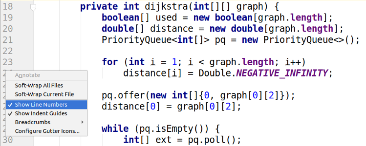

# Show line numbers

Necessitem incorporar la funció "Show line numbers" al nostre editor de codi...

## Input

L'entrada és un codi font en vàries línies.

El codi font acaba amb la paraula

## Output

S'imprimirà el mateix codi font, però amb el número de línia a l'inici de cada línia; amb aquest format:

El número de línia ocuparà dos caràcters, després hi haurà un espai en blanc, després una barra vertical i després un altre espai.
