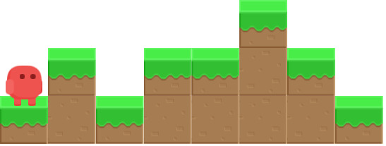

# Jump, jump!

En un joc de plataformes, el personatge ha d'anar fent salts per a poder avançar. En la situació següent, per exemple, haurà de fer 3 salts per a arribar al final:



Podem entendre el mapa del joc com una succesió de nombres que indiquen l'altura del terreny. En el cas anterior es podria definir com:

```text
1 2 1 2 2 3 2 1
```

En cada salt, el personatge pot avançar només 1 casella.

## Input

La entrada consta d'una successió de N nombres que indiquen l'altura H del terreny . La successió acaba amb un -1 (que no s'ha tenir en compte).

## Output

S'imprimirà el nombre mínim de salts que necessita donar per a arribar al final.
