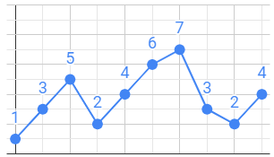
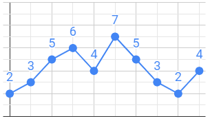
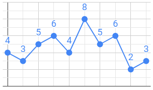
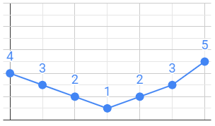
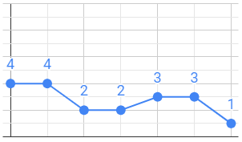
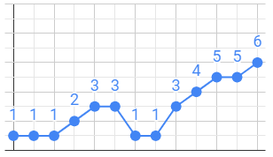

# Pics i valls

Els gràfics de línes mostren la informació en una sèrie de punts de dades connectats per segments de línies rectes. Es tracta d'un tipus bàsic de taula comú en molts camps.



Un element d'anàlisi d'aquests gràfics és dels pics i valls. Un pic és un valor local màxim, i una vall és un valor local mínim. És a dir, un pic és aquell valor el qual el seu anterior és menor que ell i el seu posterior és menor o igual que ell. I una vall és quan el seu anterior és major que ell i el seu posterior és major o igual que ell.

Al gràfic de dalt trobem dos pics (5 i 7) i dues valls (2 i 2). El primer i l'últim valor no els hem de comptar.

## Input

La entrada consta d'una seqüència de <span style="font-size: 100%; display: inline-block;" class="MathJax_SVG" id="MathJax-Element-1-Frame"><svg xmlns:xlink="http://www.w3.org/1999/xlink" width="2.064ex" height="2.176ex" style="vertical-align: -0.338ex;" viewBox="0 -791.3 888.5 936.9" role="img" focusable="false"><g stroke="currentColor" fill="currentColor" stroke-width="0" transform="matrix(1 0 0 -1 0 0)"><path stroke-width="1" d="M234 637Q231 637 226 637Q201 637 196 638T191 649Q191 676 202 682Q204 683 299 683Q376 683 387 683T401 677Q612 181 616 168L670 381Q723 592 723 606Q723 633 659 637Q635 637 635 648Q635 650 637 660Q641 676 643 679T653 683Q656 683 684 682T767 680Q817 680 843 681T873 682Q888 682 888 672Q888 650 880 642Q878 637 858 637Q787 633 769 597L620 7Q618 0 599 0Q585 0 582 2Q579 5 453 305L326 604L261 344Q196 88 196 79Q201 46 268 46H278Q284 41 284 38T282 19Q278 6 272 0H259Q228 2 151 2Q123 2 100 2T63 2T46 1Q31 1 31 10Q31 14 34 26T39 40Q41 46 62 46Q130 49 150 85Q154 91 221 362L289 634Q287 635 234 637Z"></path></g></svg></span> valors. La seqüència acaba amb un -1 que no s'ha de comptar.

## Output

S'imprimirà el nombre de pics i el nombre de valls. També s'imprimirà el valor màxim i el valor mínim.

## Tests

### Test
```input
1 3 5 2 4 6 7 3 2 4     -1
```
```output
2
2
7
1
```
```explanation
Hi ha dos pics, dues valles, el valor màxim és 7 i el mínim és 2


```

### Test
```input
2 3 5 6 4 7 5 3 2 4     -1
```
```output
2
2
7
2
```
```explanation
Hi ha tres pics, quatre valls, el valor màxim és 8 i el mínim 2.


```

### Test
```input
4 3 5 6 4 8 5 6 2 3     -1
```
```output
3
4
8
2
```
```explanation
Hi ha zero pics, una vall, el màxim és 5 i el mínim 1 


```

### Test
```input
4 3 2 1 2 3 5     -1
```
```output
0
1
5
1
```
```explanation

```

### Test
```input
4 4 2 2 3 3 1     -1
```
```output
1
1
4
1
```
```explanation

```

### Test
```input
1 1 1 2 3 3 1 1 3 4 5 5 6     -1
```
```output
2
1
6
1
```

### Test
```input
45 45 45 89 89 1 3 25 25 24 25 24 2     -1
```
```output
3
2
89
1
```

### Test
```input
1 1     -1
```
```output
0
0
1
1
```

### Test
```input
4 5     -1
```
```output
0
0
5
4
```

### Test
```input
7 5     -1
```
```output
0
0
7
5
```

### Test private
```input
1 4 3 5 2 6 4 9     -1
```
```output
3
3
9
1
```
