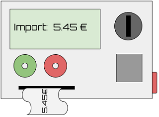
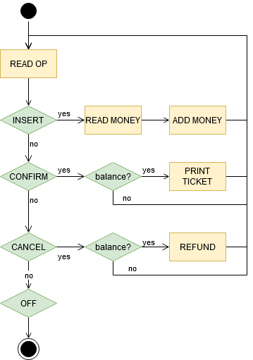

# Ticket machine

Es demana implementar una màquina expenedora de tíquets.

Els usuaris de la màquina insereixen diners, i reben un tíquet per valor dels diners inserits. També poden cancel·lar l'operació i recuperar els diners inserits.

La màquina poseeix un *display* que informa del balanç de diners que l'usuari ha inserit. Està en funcionament ininterrompudament fins es pitja un botó d'apagat.



El següent diagrama de flux mostra el funcionament de la màquina:



## Input

La entrada consisteix en una seqüència d'operacions. L'última operació sempre és la d'apagar la màquina.

operacions = `{ INSERT | CONFIRM | CANCEL }`

L'operació `INSERT` antecedeix a la  de diners inserits.

## Output

S'anirà mostrant el resultat de les operacions:

- ADD MONEY: `Balance: $BALANCE`

- PRINT TICKET: `Ticket: $BALANCE`

- REFUND: `Refund: $BALANCE`

## Tests

### Test 14.29
```input
INSERT 10
INSERT 10
CONFIRM
OFF
```
```output
Balance: 10
Balance: 20
Ticket: 20
```

### Test 14.29
```input
INSERT 10
INSERT 10
CONFIRM
OFF
```
```output
Balance: 10
Balance: 20
Ticket: 20
```

### Test private 14.29
```input
INSERT 10
INSERT 10
CONFIRM
INSERT 10
CONFIRM
OFF
```
```output
Balance: 10
Balance: 20
Ticket: 20
Balance: 10
Ticket: 10
```

### Test private 14.29
```input
INSERT 10
INSERT 10
CANCEL
INSERT 10
CONFIRM
OFF
```
```output
Balance: 10
Balance: 20
Refund: 20
Balance: 10
Ticket: 10
```

### Test private 14.29
```input
INSERT 10
INSERT 10
CANCEL
CONFIRM
INSERT 10
CONFIRM
CONFIRM
OFF
```
```output
Balance: 10
Balance: 20
Refund: 20
Balance: 10
Ticket: 10
```

### Test private 14.29
```input
CONFIRM
CONFIRM
CANCEL
CANCEL
CONFIRM
INSERT 10
CONFIRM
CONFIRM
OFF
```
```output
Balance: 10
Ticket: 10
```

### Test private 14.26
```input
CONFIRM
CANCEL
INSERT 10
CONFIRM
INSERT 10
INSERT 10
CONFIRM
CANCEL
INSERT 10
OFF
```
```output
Balance: 10
Ticket: 10
Balance: 10
Balance: 20
Ticket: 20
Balance: 10
```
