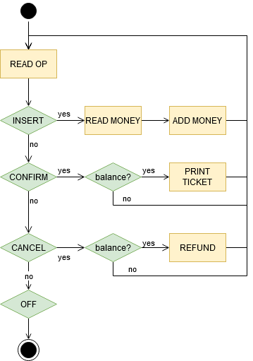

# Ticket machine

Es demana implementar una màquina expenedora de tíquets.

Els usuaris de la màquina insereixen diners, i reben un tíquet per valor dels diners inserits. També poden cancel·lar l'operació i recuperar els diners inserits.

La màquina poseeix un *display* que informa del balanç de diners que l'usuari ha inserit. Està en funcionament ininterrompudament fins es pitja un botó d'apagat.

El següent diagrama de flux mostra el funcionament de la màquina:

## Input

La entrada consisteix en una seqüència d'operacions. L'última operació sempre és la d'apagar la màquina.

operacions = `{ INSERT | CONFIRM | CANCEL }`

L'operació `INSERT` antecedeix a la  de diners inserits.

## Output

S'anirà mostrant el resultat de les operacions:

- ADD MONEY: `Balance: $BALANCE`

- PRINT TICKET: `Ticket: $BALANCE`

- REFUND: `Refund: $BALANCE`
