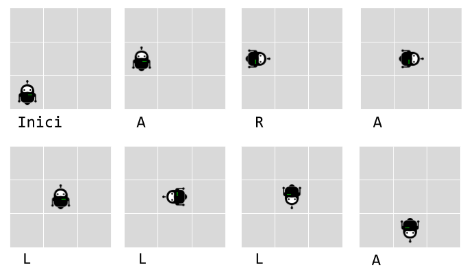

# Robot simulator

La instal·lació de proves d'una fàbrica de robots necessita un programa per verificar els moviments del robot.

Els robots tenen tres possibles moviments:

- gir a la dreta (R)

- gir a l'esquerra (L)

- avançar (A)

Els robots es col loquen en una xarxa hipotètica infinita, orientats cap a una direcció particular (, , , ) en unes coordenades {, }.

Aleshores el robot rep diverses instruccions, moment en què la instal·lació de proves verifica la nova posició del robot i en quina direcció apunta.

Per exemple, la cadena de lletres  significa:

- Avançar (A)

- Gir a la dreta (R)

- Avançar (A)

- Gir a l'esquerra x3 (LLL)

- Avançar (A)

Digueu que un robot comença a {0, 0} mirant al nord. A continuació, executar aquest flux d'instruccions hauria de deixar-lo a {1, 0} mirant al sud.

## Input

La entrada consisteix en:

Dos nombres {, } indicant les coordenades de la posició inicial.

Un caràcter  indicant la orientació inicial.

Una cadena de  caràcters amb les instruccions

-100 <= X <= 100

-100 <= Y <= 100

O = { |  |  | }

1 <= L <= 100

## Output

S'imprimiran les coordenades finals {, } i la orientació en que queda el robot
